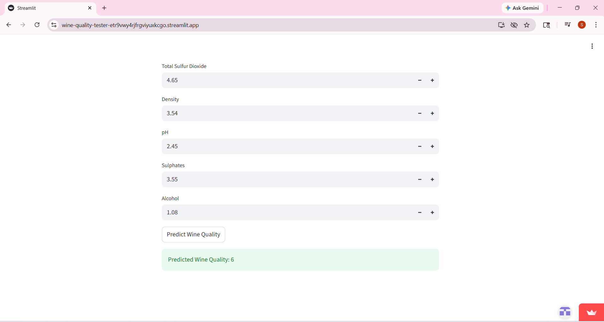

🍷 Wine Quality Prediction ML App

This project is a Machine Learning web application that predicts the quality of wine based on physicochemical properties.

🚀 Features

- Interactive UI built using Streamlit
- Predicts wine quality instantly
- Real-time user input
- Data-driven insights

🧠 Machine Learning Model

- Algorithm: Linear Regression
- Dataset: Wine Quality Dataset
- Features used:
  - Fixed acidity
  - Volatile acidity
  - Citric acid
  - Residual sugar
  - Chlorides
  - Free sulfur dioxide
  - Total sulfur dioxide
  - Density
  - pH
  - Sulphates
  - Alcohol

📊 Sample Output

Predicted Wine Quality: 6 (Average Quality 🍷)

💡 Insight

Higher alcohol and sulphates tend to positively influence wine quality.

🛠 Tech Stack

- Python
- Scikit-learn
- Streamlit
- Pandas, NumPy

🌐 Live Demo
https://wine-quality-tester-etr9vwy4rjfrgviyuxkcgo.streamlit.app/

## 📸 App Preview

📌 How to Run

pip install -r requirements.txt
streamlit run app.py
