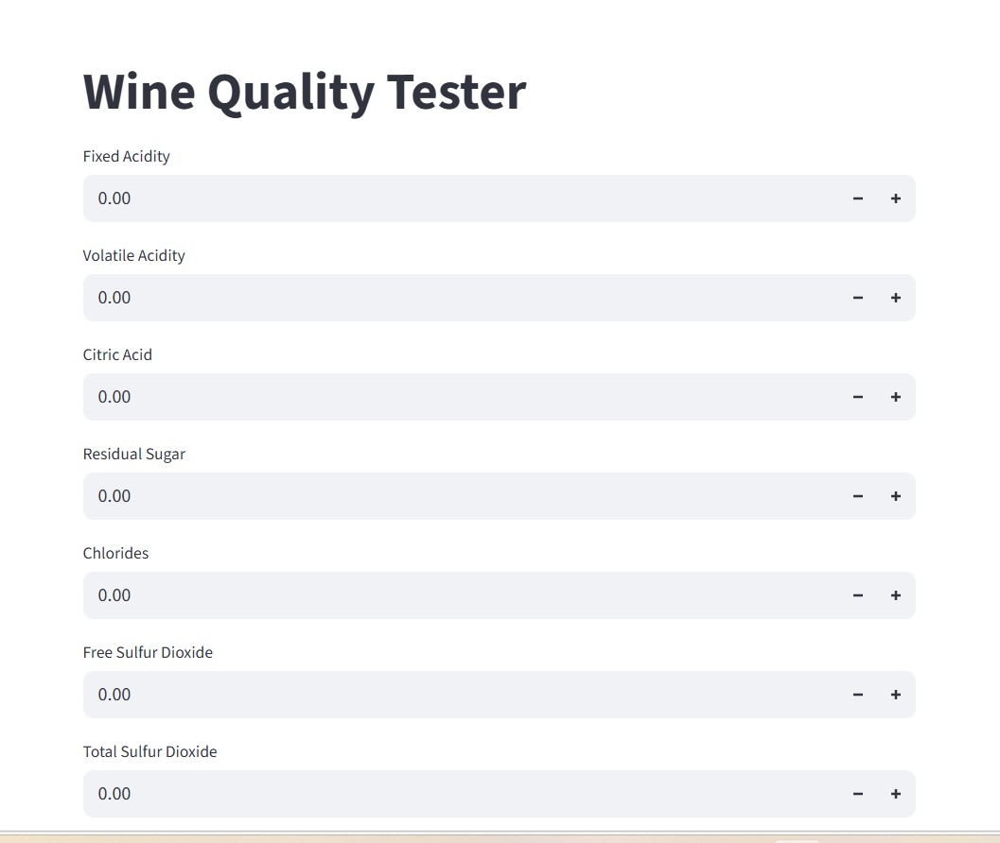

# wine-quality-tester
## App Screenshot

Machine learning web app that predicts wine quality using Streamlit.
Wine Quality Tester ML App

This project predicts wine quality using machine learning.

Tech Stack:
- Python
- Scikit-learn
- Streamlit

Features:
- User input for wine chemical properties
- ML model predicts wine quality
- Deployed on Streamlit Cloud

Live App:
https://wine-q.streamlit.app

Model: Random Forest Classifier
Accuracy: 87%
Dataset: Wine Quality Dataset
Features: 11 chemical properties
